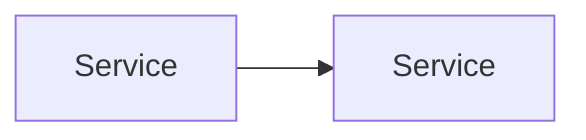

# Brainstorming

## Purpose

Clarify what should be built before planning begins. Resolve ambiguity in the problem, the intended outcome, or the approach. Land on a clear direction that planning can execute against.

## When To Use

- The problem itself is still under-defined.
- The intended outcome is unclear or has multiple valid interpretations.
- There are materially different product directions to explore before committing to a plan.
- Option comparison is needed to narrow down the right approach in an unfamiliar problem space.

## When Not To Use

- Requirements are specific and well-scoped. Go to planning.
- The task is a known fix or implementation with no meaningful design choice.
- The problem is clear but needs implementation option comparison. Go to planning.

## Core Principles

1. **Clarify before committing.** The goal is to resolve ambiguity in the problem, the outcome, or the direction. Do not proceed to planning until the problem is defined well enough to plan against.
2. **Land on a decision.** Every brainstorm must end with a clear direction. Exploration without a conclusion is wasted work.
3. **Stay focused on what, not how.** Implementation details belong in planning. Brainstorming defines the problem and the chosen direction.
4. **Match the problem's complexity, not more.** Capture the real difficulty of the problem faithfully. Do not add speculative requirements, premature abstractions, or hypothetical future concerns that the problem itself does not demand.
5. **One question at a time.** Do not overwhelm with multiple questions. Confirm understanding before moving forward.

## Workflow

1. **Assess clarity.** Is the problem defined well enough to plan? If yes, skip to planning. If not, proceed.
2. **Research the problem space.** Read relevant code, docs, specs, and existing patterns. Understand what exists and what the problem touches.
3. **Interview for clarity.** Ask focused questions one at a time across the prescribed categories. Confirm understanding before moving forward.
4. **Explore options.** When multiple directions are viable, compare them. Include only real options that meet the quality bar. Land on a recommendation.
5. **Capture the decision.** Write the brainstorm document with uniform headings.

## Question Categories

These categories should be covered during the interview step. Not every category applies to every brainstorm — mark N/A when not relevant.

1. **Problem definition.** What is the actual problem and why does it matter now?
2. **User intent.** Who needs this and what outcome do they expect?
3. **Success criteria.** What does success look like concretely?
4. **Constraints.** Known limits — technical, timeline, scope, dependencies.
5. **Existing patterns.** What already exists that is relevant? What has been tried before?
6. **Edge cases and risks.** What could go wrong? What should explicitly not happen?

## Output Location

Brainstorm documents are written to `docs/brainstorms/` with date-prefixed filenames:

```
docs/brainstorms/YYYY-MM-DD-<descriptive-name>.md
```

## Brainstorm Template

```markdown
---
title: <brainstorm title>
date: YYYY-MM-DD
status: exploring | decided
---

# <Brainstorm Title>

## Problem Statement

What problem is being solved and why it matters.

## User Intent

Who needs this and what outcome they expect.

## Success Criteria

How to know the solution is working.

## Constraints

Known limits that shape the direction.

## Options Explored

Viable directions considered. What each offers and its key tradeoff.

### Option A: <name>

<description and tradeoff>

### Option B: <name>

<description and tradeoff>

### Selected: <option>

<why this direction>

## Architecture Sketch

Rough sketch of boundaries and data flow for the selected direction. Use Mermaid fenced code blocks.



## Key Decisions

Decisions made during exploration with rationale.

## Open Questions

Unresolved questions that planning or implementation must answer.

## Next Steps

What happens next — typically planning.
```

## Constraints On This Skill

- This skill explores and documents decisions only. It must never generate implementation code.
- Questions are asked one at a time. Confirm understanding before moving forward.
- All template headings are mandatory. Mark sections N/A when not relevant.
- File references use paths relative to the repository root.
- Keep instructions agent-agnostic. No tool-specific or platform-specific references.
