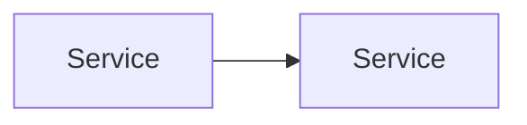

# Planning

## Purpose

Create a plan of record that serves as both spec and execution plan. The plan is rooted in what actually exists, preserves the canonical architecture direction, and makes it possible to hand off execution without losing intent.

## When To Use

- A task that is not a straightforward fix.
- A change that crosses module or service boundaries.
- A task that requires choosing between viable approaches.
- A spec or idea that needs an execution plan before implementation begins.
- A small change that still requires architectural judgment or understanding downstream implications.

## When Not To Use

- The problem itself is still under-defined. Use brainstorming first.
- The task is a known-good fix with an obvious single implementation path.

## Core Principles

1. **Spec first, implementation second.** A plan is required for any nontrivial work. The plan of record is the spec — it defines what the thing is and how to build it in one document.
2. **Model first, patch second.** Understand the data and domain model before proposing changes. Changes to behavior follow from a clear picture of the model.
3. **Reuse existing structures — evaluate fit first.** Prefer extending what exists. If the existing structure does not support the change, the plan must say so and justify reshaping it.
4. **Prefer the canonical path.** Choose the direction that strengthens the intended architecture. Breaking things to get the architecture right is acceptable.
5. **Structure changes for reviewability.** Break work into phases along API boundaries and implementation layers. Each change should be traceable to the design and easy to review independently. No code golf, no unnecessary abstractions, no leaked abstractions. Each service and boundary has a responsibility — respect it.
6. **Make proof strategy explicit.** Verification is part of the plan, not an afterthought. Define what evidence proves the change is correct.

## Workflow

1. **Ground in the real system.** Read code. Understand current state, existing patterns, and relevant workflows. Reference specific files and line numbers.
2. **Frame the problem.** Define constraints, invariants, non-goals. Challenge the scope — is it right before proceeding?
3. **Evaluate structural fit.** Does the existing architecture support this change? What can be reused, what needs modification, what must be new? This is an explicit architectural gate, not an assumption.
4. **Compare options.** Only when multiple viable approaches exist. Include 2–4 real options that meet the quality bar. No straw men, no hacky shortcuts.
5. **Define canonical architecture direction.** State the chosen path and why.
6. **Define model and API boundaries.** Specify data model changes, new types, service boundaries, and API surface affected by the change.
7. **Diagram architecture.** Data flow and service responsibility diagrams in Mermaid. Embed directly in the plan document.
8. **Break into phases.** Ordered, incremental, along API boundaries and implementation layers. Each phase should be independently reviewable.
9. **Apply review lenses.** Verify each lens against the plan. Check off each one explicitly.
10. **Define acceptance criteria and verification.** Concrete evidence that proves the change is correct.
11. **Separate now from later.** Triage deferred work as: must do now, good follow-up, or not worth doing.

## Output Location

Plans are written to `docs/plans/active/` with date-prefixed filenames:

```
docs/plans/active/YYYY-MM-DD-<descriptive-name>.md
```

For large efforts, emit multiple plan files using the same heading structure.

## Plan Template

```markdown
---
title: <plan title>
date: YYYY-MM-DD
status: proposed | active | completed
---

# <Plan Title>

## Current State & What Exists

What the system looks like today. What code, patterns, services, and workflows already exist that are relevant. What the plan should reuse, extend, or deliberately replace.

Reference specific files and line numbers:

- `src/path/to/file.ts:42-78` — description of what this code does
- `src/path/to/other.ts:15-30` — description of relevance

## Constraints

Hard limits that shape the solution. Language/runtime constraints, platform constraints, repo conventions, existing APIs, migration realities, time/scope limits, compatibility expectations.

## Invariants

Things that must remain true after the change. Behavioral guarantees, trust boundaries, safety properties, data integrity rules, architectural rules that cannot be broken.

## Non-Goals

Work intentionally excluded. Prevents scope creep. Makes it clear what becomes a follow-up issue instead of being smuggled into the current plan.

## Options Considered

Viable approaches that meet the quality bar. Typically 2–4. No straw men, no hacky shortcuts.

### Option A: <name>

<description and key tradeoff>

### Option B: <name>

<description and key tradeoff>

### Selected: <option>

<why this option strengthens the intended architecture>

## Canonical Architecture Direction

The chosen path and why it strengthens the intended architecture.

## Model & API Boundaries

Data model changes, new types, service boundaries, and API surface affected by the change. Define the shape of the model and the contracts between services.

## Architecture

Data flow and service responsibility diagrams. Use Mermaid fenced code blocks.



## Phases

Ordered implementation steps grouped for incremental execution and validation. Structured along API boundaries and implementation layers.

### Phase 1: <name>

<what changes, what it touches, how to validate>

### Phase 2: <name>

<what changes, what it touches, how to validate>

## Acceptance Criteria

The specific conditions that must be true for the work to be considered complete.

- [ ] <criterion>
- [ ] <criterion>

## Verification

Concrete evidence that proves the change is correct. Tests, manual behavior checks, reproduction evidence, concurrency checks, screenshots, logs, or targeted commands. Not vague assertions of confidence.

## Deferred Work

- **Must do now** — required for the current acceptance criteria.
- **Good follow-up** — valuable but not necessary for the current change.
- **Not worth doing** — considered and rejected.
```

## Review Lenses

Verify each lens against the plan before finalizing. Full enforcement happens post-implementation.

- [ ] **DRY.** No duplication that creates maintenance drag.
- [ ] **Service and API boundaries.** Responsibilities stay in the correct layer. No leaked abstractions (e.g., internal types exposed across service boundaries, implementation details surfacing in consumer APIs).
- [ ] **Concurrency safety.** Language-specific correctness addressed.
- [ ] **Performance gaps.** No N+1 queries, accidental serial work, or unnecessary blocking.
- [ ] **Pattern conformity.** No new patterns that cut against the existing codebase without strong justification.
- [ ] **Type safety.** Typed boundaries preserved or improved.
- [ ] **Testing philosophy.** Verification plan aligns with testing-philosophy principles.

## Constraints On This Skill

- This skill researches and writes the plan only. It must never generate implementation code.
- File references use paths relative to the repository root.
- All plan template headings are mandatory. Mark sections N/A when not relevant.
